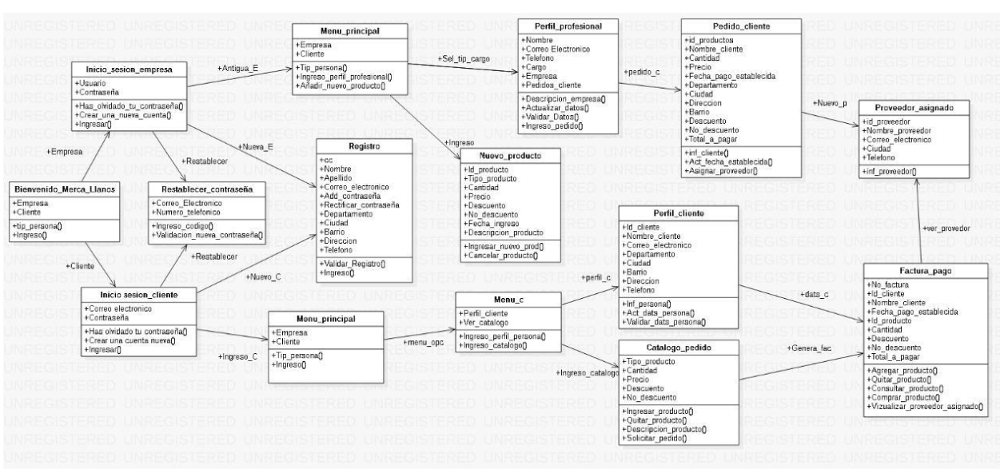
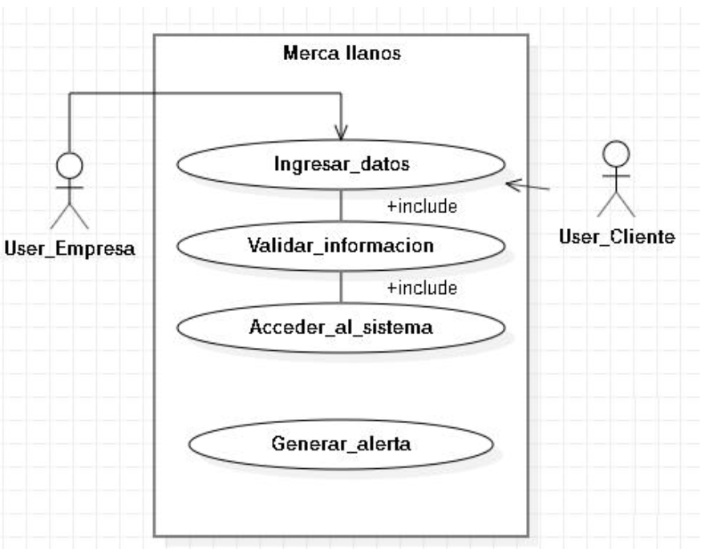
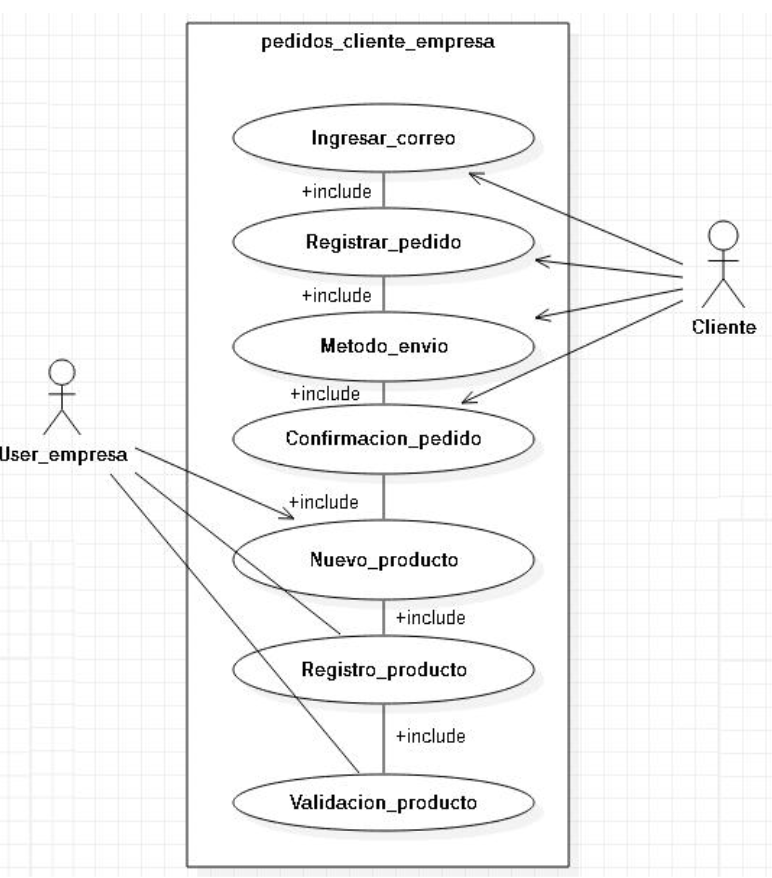
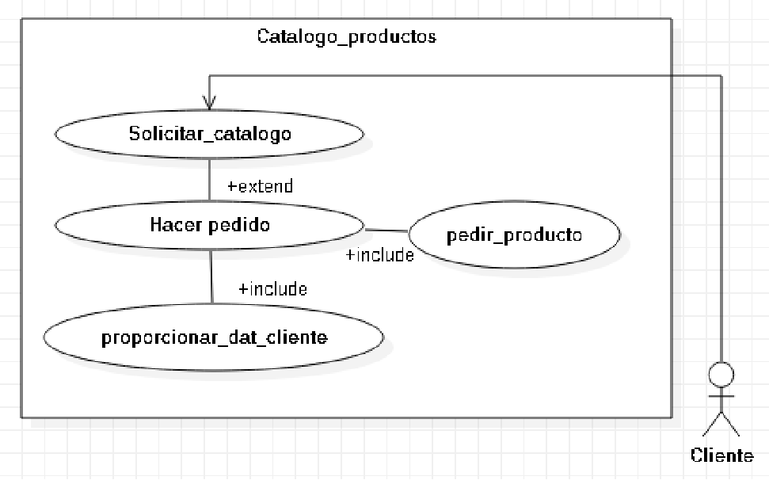
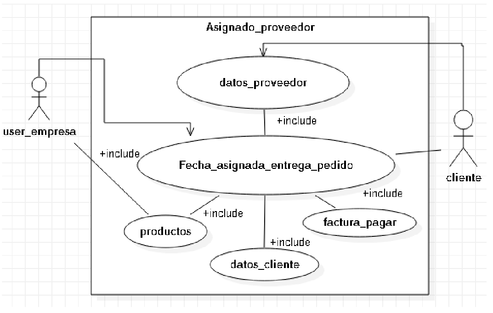
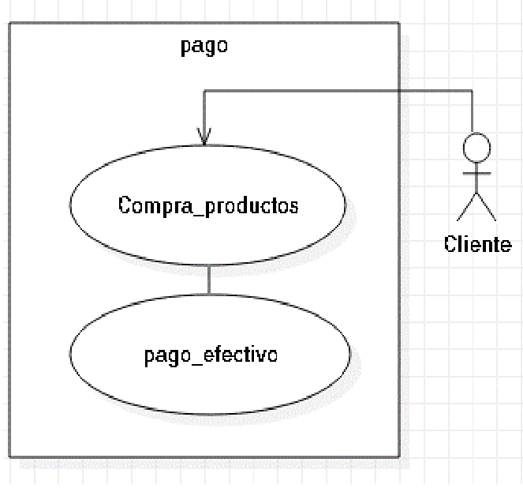

# Empresa de Delivery (Tipo Rappi)

Este es un proyecto de backend para una empresa de delivery similar a Rappi. El objetivo es desarrollar un sistema que permita gestionar pedidos, productos, usuarios y otras funcionalidades esenciales para una plataforma de entrega de productos a domicilio. El proyecto se llevará a cabo utilizando MongoDB y Node.js como tecnologías principales.

## Investigación Preliminar

Antes de comenzar con el desarrollo, es esencial realizar una investigación exhaustiva sobre cómo funciona una empresa de delivery como Rappi. Esto incluye:

1. **Análisis de la Base de Datos**: Comprender la estructura de la base de datos de Rappi o de empresas similares. Esto implica identificar las colecciones/documentos clave, relaciones entre ellos y los campos relevantes.
2. **Funcionalidades del Sistema**: Estudiar las características y funcionalidades de Rappi, como la gestión de pedidos, la interacción con los usuarios, el seguimiento de entregas, etc.
3. **Trabajo en Equipo**: Establecer una comunicación eficiente y colaboración con el otro miembro del equipo para distribuir las tareas, coordinar el trabajo y asegurar una implementación coherente.
4. **Control de Versiones (Git)**: Asegurarse de entender el flujo de trabajo de Git, incluyendo la creación de ramas, fusiones y la resolución de conflictos.
5. **Herramientas de Gestión (Notion)**: Utilizar herramientas de gestión como Notion para mantener un seguimiento de las tareas, el progreso del proyecto y cualquier información relevante.

## Colaboración y Control de Versiones

El proyecto se llevará a cabo en colaboración con otro miembro del equipo. Utilizaremos Git como sistema de control de versiones para gestionar el código de manera efectiva.

### Flujo de Trabajo con Git

1. **Clonar el Repositorio**: Ambos miembros del equipo clonarán el repositorio del proyecto en sus máquinas locales.
2. **Creación de Ramas (Branches)**: Cada nueva funcionalidad o tarea se desarrollará en su propia rama. Esto asegura que los cambios no afecten directamente a la rama principal (main/master).
3. **Trabajo en Paralelo**: Cada miembro del equipo trabajará en su rama para desarrollar las funcionalidades asignadas.
4. **Comunicación**: Mantendremos una comunicación constante para resolver cualquier duda, discutir el diseño o solucionar posibles conflictos.
5. **Fusiones (Merges)**: Una vez que una funcionalidad esté completa, se fusionará con la rama principal a través de una solicitud de extracción (pull request). Esto permite revisar y discutir los cambios antes de incorporarlos.
6. **Resolución de Conflictos**: Si surgen conflictos al fusionar ramas, los resolveremos de manera colaborativa.

## Desarrollo del Proyecto

Con base en la investigación preliminar y las tareas asignadas, comenzaremos el desarrollo del proyecto utilizando las siguientes tecnologías:

- **MongoDB**: Utilizaremos MongoDB como nuestra base de datos NoSQL para almacenar información sobre usuarios, productos, pedidos, etc.
- **Node.js**: Implementaremos el backend utilizando Node.js para manejar las solicitudes, la lógica del negocio y la interacción con la base de datos.

## README del Proyecto

A medida que avancemos en el desarrollo, crearemos un README detallado para el proyecto, que incluirá la información siguiente:

- **Descripción del Proyecto**: Una visión general del propósito y la funcionalidad del sistema de delivery.
- **Requisitos**: Los requisitos técnicos y herramientas necesarias para ejecutar el proyecto.
- **Instrucciones de Instalación**: Cómo configurar el entorno de desarrollo y ejecutar el proyecto en una máquina local.
- **Documentación API**: Detalles sobre las rutas de la API, los parámetros esperados, las respuestas y ejemplos de uso.
- **Contribución**: Instrucciones para contribuir al proyecto, incluyendo el flujo de trabajo de Git, reglas de estilo de código y cómo proponer nuevas funcionalidades.
- **Equipo**: Información sobre los miembros del equipo que participaron en el desarrollo.

## Conclusiones

Este proyecto de backend para una empresa de delivery similar a Rappi será una experiencia valiosa para aprender sobre el trabajo en equipo, la colaboración en proyectos de desarrollo, la gestión de bases de datos y la implementación de una API. A través de una investigación sólida y una comunicación eficiente, esperamos lograr un sistema funcional y bien documentado que satisfaga las necesidades del proyecto de clase.

### Investigación:

###### Base de datos guía:

###### Relacion Empresa-Cliente:

###### Información del pedido:

###### Catalogo:

###### Información del proveedor:

###### Pago:

Se le debe asignar a la aplicación de delivery las siguientes incorporaciones que hemos implementado:

1. **Gestión Integral:** Administra clientes, proveedores, empleados, facturas, productos y pedidos, centralizando toda la información esencial en un solo lugar.
2. **Programación de Pedidos Avanzada:** Ofrece a tus clientes la capacidad de programar entregas, rastrear el estado de los pedidos y recibir estimaciones precisas de la entrega.
3. **Experiencia de Cliente Mejorada:** Facilita la cancelación, devolución y reemplazo de pedidos, permitiendo a los clientes presentar quejas o solicitar reembolsos de manera sencilla a través de la aplicación.
4. **Flexibilidad de Recogida y Entrega:** Los clientes pueden elegir la ubicación de recogida y entrega de los pedidos, incluso agregar manualmente direcciones según sus preferencias.
5. **Control y Monitoreo:** Los propietarios de las tiendas pueden gestionar pedidos, verificar estados, monto recaudado por pedido y tomar medidas correspondientes de manera eficiente.
6. **Incorporación de Productos Rápida:** Los gerentes de tiendas pueden agregar nuevos productos en tiempo real y ver los cambios reflejados al instante en la aplicación.
7. **Descuentos y Promociones:** Los usuarios pueden aplicar cupones de descuento en el momento del pago, ofreciendo ventajas atractivas para tus clientes.
8. **Selección de Tiendas Basada en Ubicación:** Permite a los clientes elegir la tienda de comestibles más cercana a su ubicación para realizar pedidos.
9. **Gestión Transparente:** Proporciona a los propietarios de las tiendas información detallada sobre ingresos, informes, liquidaciones de pagos exitosos y pendientes.
10. **Seguimiento de Actividades:** Controla, administra y rastrea cada actividad comercial sin complicaciones, brindando una vista integral de las operaciones.
11. **Interacción con Clientes:** Facilita la gestión de comentarios, permite al administrador verificar las calificaciones, reseñas y comentarios de los clientes.
12. **Administración de Pagos y Comisiones:** El administrador puede rastrear todos los pagos en línea aceptados y establecer tasas de comisión con los socios de la tienda.
